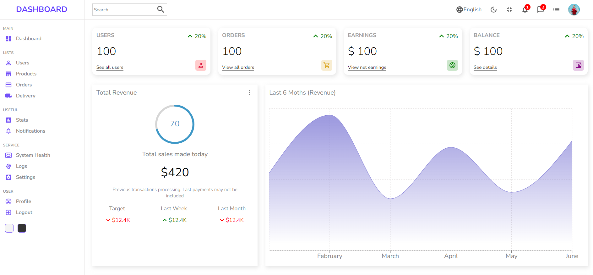
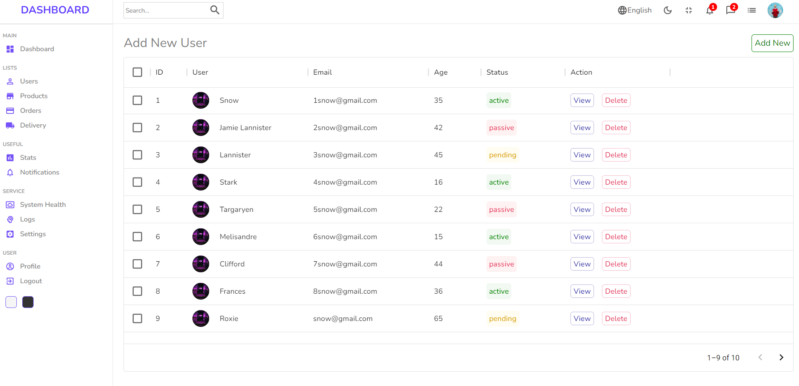

### Dashboard App Using ReactJS, Material UI, recharts, Context API

- This is a small Dashboard App which can be used to track the expenses.
- Here I used ReactJS and Material UI for developing the frontend of the app
- Used recharts for representing the data in visual format, recharts is a charting library built on React components.
- Context API is used to switch between light and dark modes in the app

